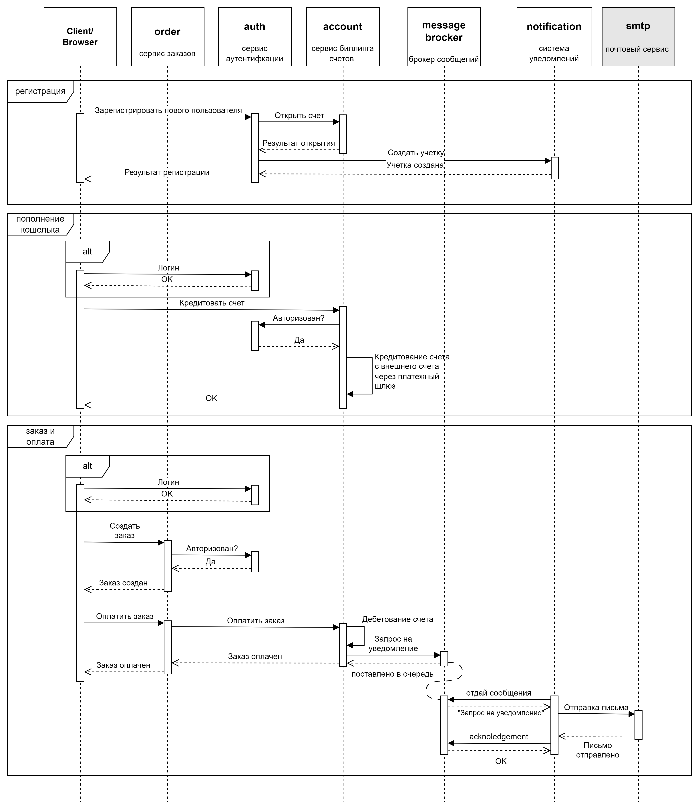

Теоретическая часть.

Варианты взаимодействия систем.

1. Только HTTP взаимодействие.


Комментарии: тут все понятно, не только взимодействие клиента с системой, но и все взаимодействия между компонентами систем - синхронные через http.

2. Событийное взаимодействие с использованием брокера сообщений для нотификаций.



Комментарии: по сравнению с первым вариантом, делаем взаимодействие биллинга (account) и сервиса уведомлений (нотификаций) асинхронным (через брокер).
Здесь вариант уведомлений "выстрелил и забыл", хотя при желании, можно организовать более сложное взаимодействие с очередью ответных сообщений и контролем на стороне 
отправляющей стороны (account)

3. Event Collaboration cтиль взаимодействия

 

Комментарии: в этом варианте синхронными оставляем только взаимодействия с клиентом (здесь тоже можно подумать в сторону использования WebSocket для формирования 
уведомлений о выполнении запрошенных операций, но это не всегда укладывается в пользовательские сценарии), а также аутентификацию через сервис аутентификации.
Остальные взаимодействия делаем асинхронными, через брокер:
- взаимодействие "система аутентификации (auth) - биллинг (account)", заявка на открытие счета, здесь упрощенно по принципу "выстрелил и забыл", без механизма ответных 
  сообщений;
- взаимодействие "система аутентификации (auth) - система нотификации (notification)", заявка на заведение учетной записи (связка "пользователь - email"), "выстрелил и забыл";
- взаимодействие "биллинг (account) - система нотификации (notification)", уведомление о проведении/отклонении операции, "выстрелил и забыл"; 
- взаимодействие "система заказов (order) - биллинг (account)", запрос на совершение платежа и обратный поток с результатом операции. 

Выбор решения

На мой взгляд, Event Collaboration неплохо подходит для бекэнд сценариев, которых тут у нас несколько. Но плохая идея завязывать синхронное взаимодействие клиента с order по
оплате заказа на асинхронный бекэнд (особенно, если в будущем в этом сценарии потребуется еще взаимодействие с клиентом для подтверждения операции, через резервный канал 
связи, например). Здесь будет удобнее взаимодействовать через http, как в 1 и 2 сценарии. Очереди ответов и матчинг "запрос - ответ" на строне отправителя не проектируем, 
хотя для реализации подобной системы на production настоятельно рекомендуются.

Получается так:


Практическая часть.

Инструкция по установке.

Предпроверки

Убедитесь, что:
- nginx-ingress установлен и включен в кластере.
- доменное имя arch.homework роутится на хост, на котором установлен minikube.
- пути:
     - http://arch.homework/aboldyrev/*
   не используются другими сервисами.

Создаем и делаем дефолтным namespace learning

```
kubectl create ns learning

kubectl config set-context --current --namespace=learning

```

переходим в каталог helm/ и через устанавливаем чарты для БД Postgres, RabbitMQ и приложений:

```
helm install postgres ./postgres
```

устанавливает инстанцию БД и создает отдельные БД для каждого приложения

```
helm install rabbitmq ./rabbitmq
```
 
устанавливает брокер сообщений и создает необходимые приложению объекты (queues, exchange, bindings).
Развертывание занимает около минуты (есть ожидание инициализации для создания объектов)


Установка компонентов:

```
helm install auth ./auth

helm install account ./account

helm install notification ./notification

helm install order ./order
```

Удостоверьтесь, что все необходимые чарты установлены.

3. Инструкция по тестированию

Тестовая коллекция acc-notification-test.postman_collection.json находится в каталоге postman/

Содержит следующий сценарий:

- Создать пользователя (http://arch.homework/aboldyrev/auth/register)
- Сделать login под выбранным пользователем (http://arch.homework/aboldyrev/auth/login)
- Убедиться, что счет открыт (http://arch.homework/aboldyrev/account/get)
- Положить деньги на счет пользователя через сервис биллинга (http://arch.homework/aboldyrev/auth/login)
- Убедиться, что счет пополнен (http://arch.homework/aboldyrev/account/get)
- Создать необходимые товарные позиции для того, чтобы создать заказ (http://arch.homework/aboldyrev/order/product/post)
- Сделать заказ, на который хватает денег (http://arch.homework/aboldyrev/order/place)
- Оплатить заказ, на который хватает денег (http://arch.homework/aboldyrev/order/process)
- Посмотреть деньги на счету пользователя и убедиться, что их сняли (http://arch.homework/aboldyrev/account/get)
- Посмотреть в сервисе нотификаций отправленные сообщения и убедиться, что сообщение отправилось (http://arch.homework/aboldyrev/notification/get)
- Сделать заказ, на который не хватает денег (http://arch.homework/aboldyrev/order/place)
- Попытаться оплатить заказ, на который хватает денег (http://arch.homework/aboldyrev/order/process)
- Посмотреть деньги на счету пользователя и убедиться, что их количество не поменялось (http://arch.homework/aboldyrev/account/get)
- Посмотреть в сервисе нотификаций отправленные сообщения (http://arch.homework/aboldyrev/notification/get)
- Сделать logout (http://arch.homework/aboldyrev/auth/logout)

Для запуска тестов через newman с отображением данных запроса и данных ответа используйте команду:

```
newman run acc-notification-test.postman_collection.json --verbose
```


4. Исходный код

Исходный код находится в каталоге src/

- src/order система заказов
- src/auth сервис аутентификации
- src/account сервис биллинга
- src/notification сервис нотификации